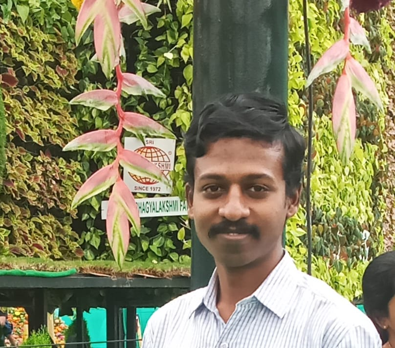

  

<h1 align="center">Hi 👋 I'm Ravi Teja S</h1>
<h3 align="center">Aspiring Software Developer | AI • Web • Systems</h3>

---

- 🔭 **I’m currently working on:** [SARS-CoV-2 Viral Phylogeny](https://github.com/Ravi-Teja-S/viral_phylogeny.git) — analyzing genomic variants using **Biopython**.
- 🌱 **I’m currently learning:** **Service-Oriented Architecture (SOA)**, Cloud Security protocols, and **Digital Twin** synchronization for environmental monitoring.
- 👯 **I’m looking to collaborate on:** Open-source Bioinformatics tools or **Python/Langflow** custom components.
- 🤔 **I’m looking for help with:** Optimizing static IP whitelisting for **Nidhi API** integrations on my **Hostinger KVM VPS**.
- 💬 **Ask me about:** Python (Pandas/Scikit-Learn), **ISRO satellite data** processing, and SARS-CoV-2 phylogenomics.
- ⚡ **Fun fact:** I actually enjoy the process of debugging—it's like solving a new puzzle every day.

  
  
  

---
## 🚀 Tech Stack

